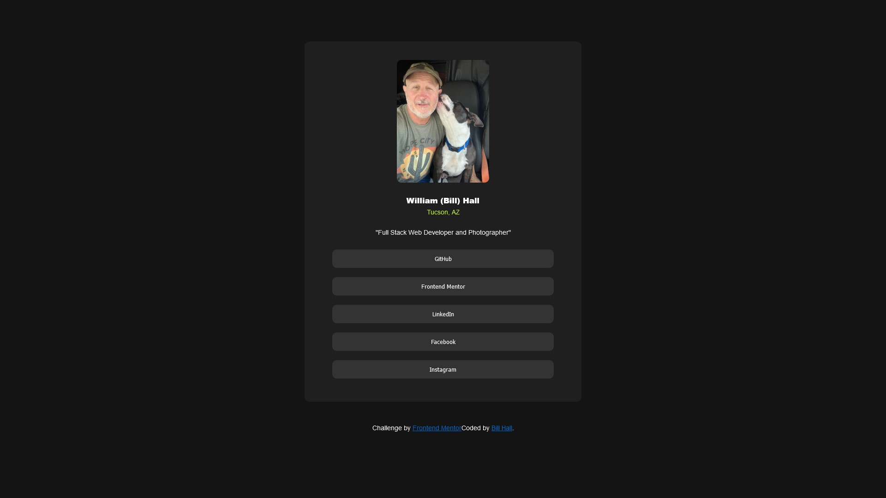

# Frontend Mentor - Social links profile solution

This is a solution to the [Social links profile challenge on Frontend Mentor](https://www.frontendmentor.io/challenges/social-links-profile-UG32l9m6dQ). Frontend Mentor challenges help you improve your coding skills by building realistic projects.

## Table of contents

- [Frontend Mentor - Social links profile solution](#frontend-mentor---social-links-profile-solution)
  - [Table of contents](#table-of-contents)
  - [Overview](#overview)
    - [The challenge](#the-challenge)
    - [Screenshot](#screenshot)
    - [Links](#links)
  - [My process](#my-process)
    - [Built with](#built-with)
    - [What I learned](#what-i-learned)
    - [Continued development](#continued-development)
    - [Useful resources](#useful-resources)
  - [Author](#author)

**Note: Delete this note and update the table of contents based on what sections you keep.**

## Overview

### The challenge

Users should be able to:

- See hover and focus states for all interactive elements on the page

### Screenshot

### Links

- Solution URL: https://flyboy85749.github.io/social-links-profile-main/
- Live Site URL: https://flyboy85749.github.io/social-links-profile-main/

## My process

I am starting to do these challenges as a way to keep up with my skills. First, as suggested, I completed the HTML so I had something to work with as far as Ids and classes in my CSS. Then, working with the style guide and figma files, I nailed down the details of fonts, sizes, colors, ...etc. of the project.

### Built with

- Semantic HTML5 markup
- CSS
- Flexbox
-

### What I learned

I learned that I am very rusty with even the basics of HTML and CSS, so had to do a lot of reading docs, which isn't a bad thing at all. Along the way, I was surprised at how much I had actually recalled, especially with using git and VS Code. I will continue to do these challenges as a way to keep up with my skills, and build a nice portfolio.

### Continued development

I want to keep learning old and new skills as the challenges dictate, because it's important to me that I stay fresh with front end development so I can develop my own domain names.

### Useful resources

- [Free Code Camp](https://www.freecodecamp.org/) - I'm all for anything that is free and is an excellent source, so FreeCodecamp is a must have for me.
- [W3 Schools](https://www.w3schools.com/) - Another great source for learning how to code.

## Author

- Website - [Bill Hall](https://christianwebdeveloper.com/)
- Frontend Mentor - [@flyboy85749](https://www.frontendmentor.io/profile/flyboy85749)
- Github - [@flyboy85749](https:/github.com/flyboy85749)
